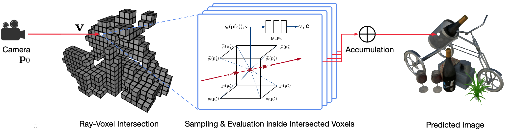
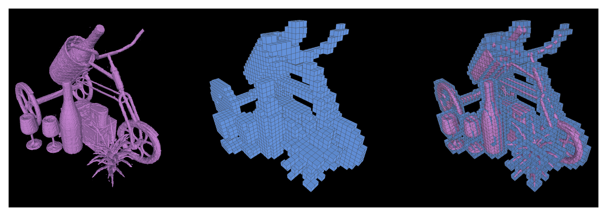

# Neural Sparse Voxel Fields (NSVF)

### [Project Page](https://lingjie0206.github.io/papers/NSVF/) | [Video](https://www.youtube.com/watch?v=RFqPwH7QFEI) | [Paper](https://arxiv.org/abs/2007.11571) | [Data](#dataset)



Photo-realistic free-viewpoint rendering of real-world scenes using classical computer graphics techniques is a challenging problem because it requires the difficult step of capturing detailed appearance and geometry models.
Neural rendering is an emerging field that employs deep neural networks to implicitly learn scene representations encapsulating both geometry and appearance from 2D observations with or without a coarse geometry.
However, existing approaches in this field often show blurry renderings or suffer from slow rendering process. We propose [Neural Sparse Voxel Fields (NSVF)](https://arxiv.org/abs/2007.11571), a new neural scene representation for fast and high-quality free-viewpoint rendering.

Here is the official repo for the paper:

* [Neural Sparse Voxel Fields (Liu et al., 2020, <span style="color:red">NeurIPS 2020 Spotlight</span>)](https://arxiv.org/abs/2007.11571).

We also provide our unofficial implementation for:
* [NeRF: Representing Scenes as Neural Radiance Fields for View Synthesis (Mildenhall et al., 2020)](https://arxiv.org/pdf/2003.08934.pdf).


## Table of contents
-----
  * [Installation](#requirements-and-installation)
  * [Dataset](#dataset)
  * [Usage](#train-a-new-model)
    + [Training](#train-a-new-model)
    + [Evaluation](#evaluation)
    + [Free-view Rendering](#free-viewpoint-rendering)
    + [Extracting Geometry](#extract-the-geometry)
  * [License](#license)
  * [Citation](#citation)
------

## Requirements and Installation

This code is implemented in PyTorch using [fairseq framework](https://github.com/pytorch/fairseq).

The code has been tested on the following system:

* Python 3.7
* PyTorch 1.4.0
* [Nvidia apex library](https://github.com/NVIDIA/apex) (optional)
* Nvidia GPU (Tesla V100 32GB) CUDA 10.1

Only learning and rendering on GPUs are supported.

To install, first clone this repo and install all dependencies:

```bash
pip install -r requirements.txt
```

Then,  run

```bash
pip install --editable ./
```

Or if you want to install the code locally, run:

```bash
python setup.py build_ext --inplace
```

## Dataset

You can download the pre-processed synthetic and real datasets used in our paper.
Please also cite the original papers if you use any of them in your work.

Dataset | Download Link | Notes on Dataset Split
---|---|---
Synthetic-NSVF | [download (.zip)](https://dl.fbaipublicfiles.com/nsvf/dataset/Synthetic_NSVF.zip) | 0_\* (training) 1_\* (validation) 2_\* (testing)
[Synthetic-NeRF](https://github.com/bmild/nerf) | [download (.zip)](https://dl.fbaipublicfiles.com/nsvf/dataset/Synthetic_NeRF.zip) | 0_\* (training) 1_\* (validation) 2_\* (testing)
[BlendedMVS](https://github.com/YoYo000/BlendedMVS)  | [download (.zip)](https://dl.fbaipublicfiles.com/nsvf/dataset/BlendedMVS.zip) | 0_\* (training) 1_\* (testing)
[Tanks&Temples](https://www.tanksandtemples.org/) | [download (.zip)](https://dl.fbaipublicfiles.com/nsvf/dataset/TanksAndTemple.zip) | 0_\* (training) 1_\* (testing)

### Prepare your own dataset

To prepare a new dataset of a single scene for training and testing, please follow the data structure:

```bash
<dataset_name>
|-- bbox.txt         # bounding-box file
|-- intrinsics.txt   # 4x4 camera intrinsics
|-- rgb
    |-- 0.png        # target image for each view
    |-- 1.png
    ...
|-- pose
    |-- 0.txt        # camera pose for each view (4x4 matrices)
    |-- 1.txt
    ...
[optional]
|-- test_traj.txt    # camera pose for free-view rendering demonstration (4N x 4)
```

where the ``bbox.txt`` file contains a line describing the initial bounding box and voxel size:

```bash
x_min y_min z_min x_max y_max z_max initial_voxel_size
```

Note that the file names of target images and those of the corresponding camera pose files are not required to be exactly the same. However, the orders of these two kinds of files (sorted by string) must match.  The datasets are split with view indices.
For example, "``train (0..100)``, ``valid (100..200)`` and ``test (200..400)``" mean the first 100 views for training, 100-199th views for validation, and 200-399th views for testing.

## Train a new model

Given the dataset of a single scene (``{DATASET}``), we use the following command for training an NSVF model to synthesize novel views at ``800x800`` pixels, with a batch size of ``4`` images per GPU and ``2048`` rays per image. By default, the code will automatically detect all available GPUs.

In the following example, we use a pre-defined architecture ``nsvf_base`` with specific arguments:

* By setting ``--no-sampling-at-reader``, the model only samples pixels in the projected image region of sparse voxels for training.
* By default, we set the ray-marching step size to be the ratio ``1/8 (0.125)`` of the voxel size which is typically described in the ``bbox.txt`` file.
* It is optional to turn on ``--use-octree``. It will build a sparse voxel octree to speed-up the ray-voxel intersection especially when the number of voxels is larger than ``10000``.
* By setting ``--pruning-every-steps`` as ``2500``, the model performs self-pruning at every ``2500`` steps.
* By setting ``--half-voxel-size-at`` and ``--reduce-step-size-at`` as ``5000,25000,75000``,  the voxel size and step size are halved at ``5k``, ``25k`` and ``75k``, respectively.

Note that, although above parameter settings are used for most of the experiments in the paper, it is possible to tune these parameters to achieve better quality. Besides the above parameters, other parameters can also use default settings.

Besides the architecture ``nsvf_base``, you may check other architectures or define your own architectures in the file ``fairnr/models/nsvf.py``.

```bash
python -u train.py ${DATASET} \
    --user-dir fairnr \
    --task single_object_rendering \
    --train-views "0..100" --view-resolution "800x800" \
    --max-sentences 1 --view-per-batch 4 --pixel-per-view 2048 \
    --no-preload \
    --sampling-on-mask 1.0 --no-sampling-at-reader \
    --valid-views "100..200" --valid-view-resolution "400x400" \
    --valid-view-per-batch 1 \
    --transparent-background "1.0,1.0,1.0" --background-stop-gradient \
    --arch nsvf_base \
    --initial-boundingbox ${DATASET}/bbox.txt \
    --use-octree \
    --raymarching-stepsize-ratio 0.125 \
    --discrete-regularization \
    --color-weight 128.0 --alpha-weight 1.0 \
    --optimizer "adam" --adam-betas "(0.9, 0.999)" \
    --lr 0.001 --lr-scheduler "polynomial_decay" --total-num-update 150000 \
    --criterion "srn_loss" --clip-norm 0.0 \
    --num-workers 0 \
    --seed 2 \
    --save-interval-updates 500 --max-update 150000 \
    --virtual-epoch-steps 5000 --save-interval 1 \
    --half-voxel-size-at  "5000,25000,75000" \
    --reduce-step-size-at "5000,25000,75000" \
    --pruning-every-steps 2500 \
    --keep-interval-updates 5 --keep-last-epochs 5 \
    --log-format simple --log-interval 1 \
    --save-dir ${SAVE} \
    --tensorboard-logdir ${SAVE}/tensorboard \
    | tee -a $SAVE/train.log
```

The checkpoints are saved in ``{SAVE}``. You can launch tensorboard to check training progress:

```bash
tensorboard --logdir=${SAVE}/tensorboard --port=10000
```

There are more examples of training scripts to reproduce the results of our paper under [examples](./examples/train/).

## Evaluation

Once the model is trained, the following command is used to evaluate rendering quality on the test views given the ``{MODEL_PATH}``.

```bash
python validate.py ${DATASET} \
    --user-dir fairnr \
    --valid-views "200..400" \
    --valid-view-resolution "800x800" \
    --no-preload \
    --task single_object_rendering \
    --max-sentences 1 \
    --valid-view-per-batch 1 \
    --path ${MODEL_PATH} \
    --model-overrides '{"chunk_size":512,"raymarching_tolerance":0.01,"tensorboard_logdir":"","eval_lpips":True}' \
```

Note that we override the ``raymarching_tolerance`` to ``0.01`` to enable early termination for rendering speed-up.

## Free Viewpoint Rendering

Free-viewpoint rendering can be achieved once a model is trained and a rendering trajectory is specified. For example, the following command is for rendering with a circle trajectory (angular speed 3 degree/frame, 15 frames per GPU). This outputs per-view rendered images and merge the images into a ``.mp4`` video in ``${SAVE}/output`` as follows:


By default, the code can detect all available GPUs.

```bash
python render.py ${DATASET} \
    --user-dir fairnr \
    --task single_object_rendering \
    --path ${MODEL_PATH} \
    --model-overrides '{"chunk_size":512,"raymarching_tolerance":0.01}' \
    --render-beam 1 --render-angular-speed 3 --render-num-frames 15 \
    --render-save-fps 24 \
    --render-resolution "800x800" \
    --render-path-style "circle" \
    --render-path-args "{'radius': 3, 'h': 2, 'axis': 'z', 't0': -2, 'r':-1}" \
    --render-output ${SAVE}/output \
    --render-output-types "color" "depth" "voxel" "normal" --render-combine-output \
    --log-format "simple"
```

Our code also supports rendering for given camera poses.
For instance, the following command is for rendering with the camera poses defined in the 200-399th files under folder ``${DATASET}/pose``:

```bash
python render.py ${DATASET} \
    --user-dir fairnr \
    --task single_object_rendering \
    --path ${MODEL_PATH} \
    --model-overrides '{"chunk_size":512,"raymarching_tolerance":0.01}' \
    --render-save-fps 24 \
    --render-resolution "800x800" \
    --render-camera-poses ${DATASET}/pose \
    --render-views "200..400" \
    --render-output ${SAVE}/output \
    --render-output-types "color" "depth" "voxel" "normal" --render-combine-output \
    --log-format "simple"
```

The code also supports rendering with camera poses defined in a ``.txt`` file. Please refer to this [example](./examples/render/render_jade.sh).

## Extract the Geometry

We also support running marching cubes to extract the iso-surfaces as triangle meshes from a trained NSVF model and saved as ``{SAVE}/{NAME}.ply``. 
```bash
python extract.py \
    --user-dir fairnr \
    --path ${MODEL_PATH} \
    --output ${SAVE} \
    --name ${NAME} \
    --format 'mc_mesh' \
    --mc-threshold 0.5 \
    --mc-num-samples-per-halfvoxel 5
```
It is also possible to export the learned sparse voxels by setting ``--format 'voxel_mesh'``.
The output ``.ply`` file can be opened with any 3D viewers such as [MeshLab](https://www.meshlab.net/). 



## License

NSVF is MIT-licensed.
The license applies to the pre-trained models as well.

## Citation

Please cite as 
```bibtex
@article{liu2020neural,
  title={Neural Sparse Voxel Fields},
  author={Liu, Lingjie and Gu, Jiatao and Lin, Kyaw Zaw and Chua, Tat-Seng and Theobalt, Christian},
  journal={NeurIPS},
  year={2020}
}
```
